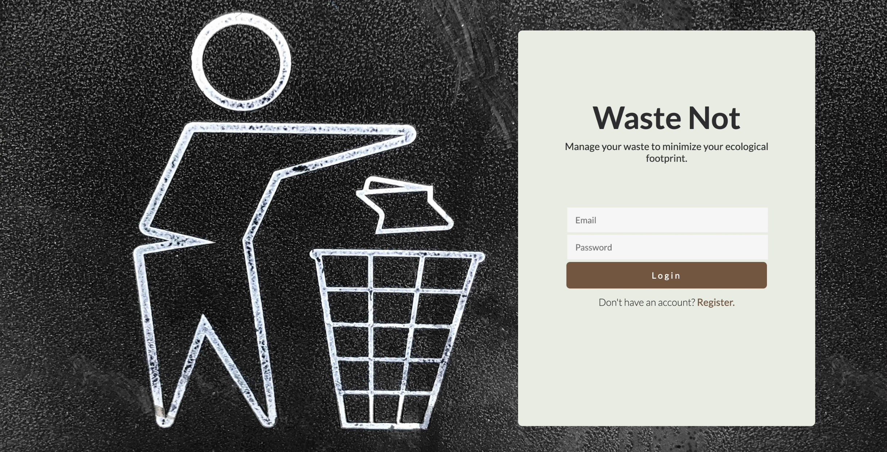
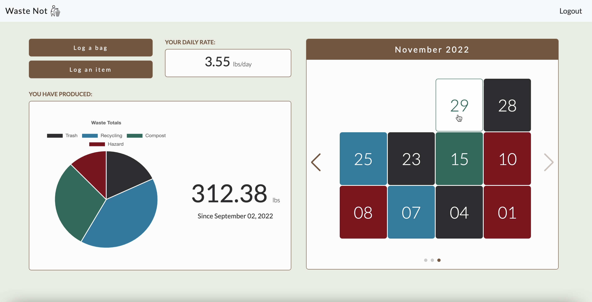
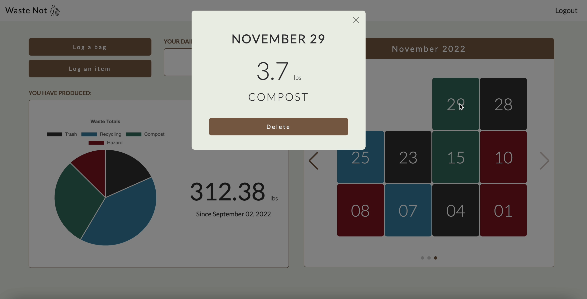
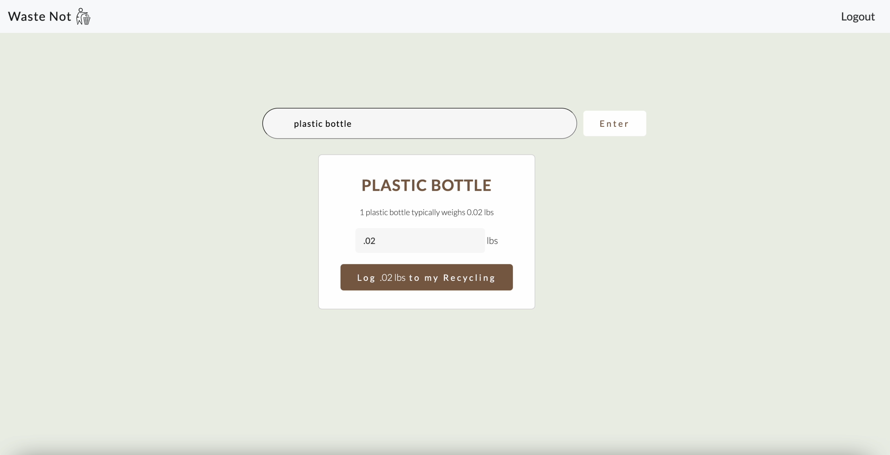

# Waste Not 
Proper waste management is a marker of a society’s health. The challenge with this is that the waste is essentially rendered invisible, making it impossible for the average citizen to visualize their daily habits' impact on the environment. 

Waste Not seeks to solve this problem by helping individuals track and manage their waste. With simple tools and analytics, Waste Not helps users become aware of patterns in the waste they produce so they can take action and become better stewards of the environment.
## Table of Contents
* :rocket: [Technologies](#technologies-used)
* :sparkles: [Features](#features)
* :construction: [Future Improvements](#future-improvements)
* :book: [Set Up](#set-up)
* :nerd_face: [About Me](#about-me)
## Technologies Used
* Backend: Python, Flask, PstgreSQL, SQLAlchemy
* Frontend: React JS, Bootstrap, Jinja2
* APIs: Chart.js, Swiper.js
## Features
🎥  [Take a video tour](https://www.youtube.com/watch?v=dwfOQtPjIxc)

### Login/Registration
* Users can choose to either Login or Register
* Passwords are hashed using Argon2


### User Dashboard
Users can:  
* Log a bag of waste 
* Log an individual item of waste 
* View their daily rate calculation
* View their total waste calculation
* View a pie chart of their waste totals, sorted by bin type
* Flip through a calendar that displays the records they have made (records are stamped with the day of the month that they were logged and are made to look as if they are piling up on top of one another)
* Click on each calendar record to view the specific weight that was logged on that day
* Delete a record 
* Logout



### Log an item
* Users can search for an item to log to their waste records
* Once the record is logged, users are brought back to their dashboard 


## Future Improvements
* Refactor Search Logic and Search page design to include more search results.
* Add a status indicator to a user’s dashboard that shows whether they are in Great, Good, Fair, or Poor standing based on their Daily Rate calculation. 
* Work on responsive design for phone screen size.
## Set Up
To run this project, clone or fork this repo: 
```
git clone https://github.com/MartaSolomianko/waste-management-project.git
```
Create and activate a virtual environment inside your directory
```
virtualenv env
source env/bin/activate
```
Install the dependencies:
```
pip install -r requirements.txt
```
Set up the database:
```
python3 seed_database.py
```
Run the app:
```
python3 server.py
```
You can now navigate to 'localhost:5000/' to access the app
## About Me
:wave: Hi, there! I'm Marta. Waste Not is my first full-stack web application. I wrote it in four weeks while I studied at Hackbright, a 12-week software engineering fellowship. 